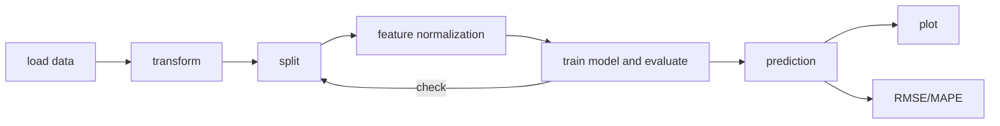

# 原物料價格預測

``` mermaid
flowchart LR;
    1[load data] --> 2[transform] --> 3[split] --> 4[feature normalization] --> 5[train model and evaluate] --> 6[prediction] --> 7[plot] & 8[RMSE/MAPE];
    5[train model and evaluate] --check--> 3[split];
```

## 黃金預測結果(Example)
